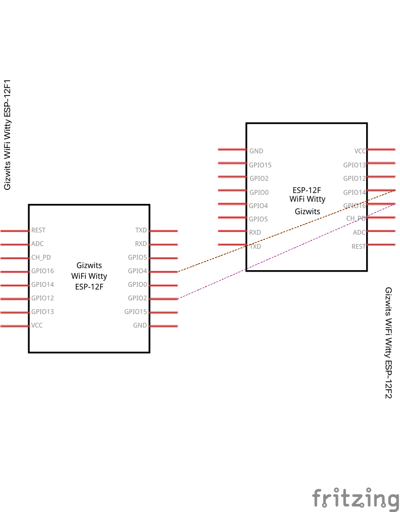

# uart lock for esphome

switching between ble and wifi might be a hassle.

# setup

2 esp32 devices that communicate via uart.

device 1 is an esphome device
device 2 is an ble device that controls the ble lock
## flash this project onto a separate esp32 device

- with espressif tools directly or use platformio

## wiring

## flash esphome onto a separate esp32 device

- store uart_lock.h in your (esphome) configuration directory.
- copy yaml into a new device configuration tab.
- flash second esp32 device.

